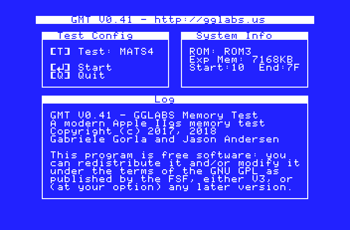
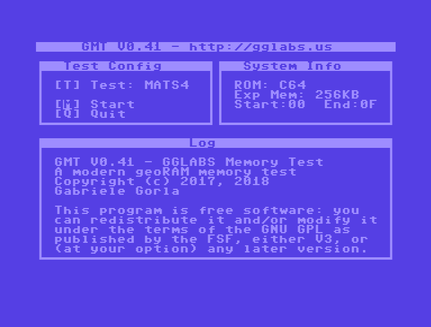

# GMT
GGLABS Memory Test for vintage computers
GMT is a memory test for vintage computers optimized for speed and coverage. The code is based on the test algorithms described in
"Testing Semiconductor Memories: Theory and Practice" by A.J. van de Goor. 
The program is mostly in C plus small sections in assembly. It is free software and released under the GPL v3 license.

GMT supports Apple IIgs memory expansion and geoRAM on Commodore 64 and Commodore 128. The Commodore 128 version can currently only run in 80 column mode.
On Commodore computers the REU is not supported as the way REU is accessed is not compatible with the testing algorithm used.
Support for on board memory on both commodore and apple is possible but not currently implemented.

